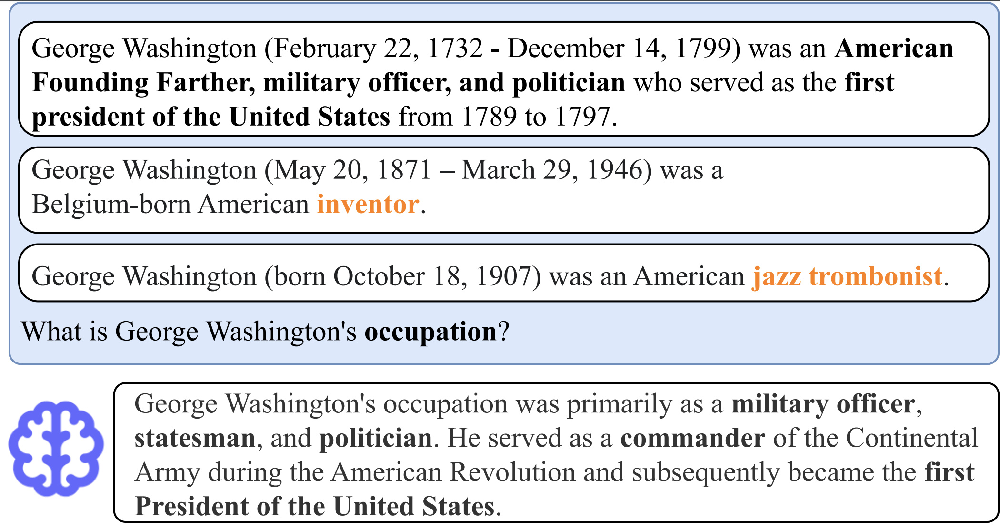

# [WhoQA: A Benchmark Dataset for Assessing LLMs' Ability to Handle Knowledge Conflicts](https://arxiv.org/abs/2410.15737)


> **Abstract**: 
Retrieval-augmented generation (RAG) methods are viable solutions for addressing the static memory limits of pre-trained language models. Nevertheless, encountering conflicting sources of information within the retrieval context is an inevitable practical challenge. In such situations, the language models are recommended to transparently inform users about the conflicts rather than autonomously deciding what to present based on their inherent biases. To analyze how current large language models (LLMs) align with our recommendation, we introduce WhoQA, a public benchmark dataset to examine model's behavior in knowledge conflict situations. We induce conflicts by asking about a common property among entities having the same name, resulting in questions with up to 8 distinctive answers. WhoQA evaluation set includes 5K questions across 13 Wikidata property types and 150K Wikipedia entities. Our experiments show that despite the simplicity of WhoQA questions, knowledge conflicts significantly degrades LLMs' performance in RAG settings.

<p align="center">	

</p>

Details of the dataset construction and experimental results can be found in [our EMNLP 2024 Findings paper]():

```bibtext
@inproceedings{WhoQA,
  title = {Who's Who: Large Language Models Meet Knowledge Conflicts in Practice},
  author = {Quang Hieu Pham and Hoang Ngo and Anh Tuan Luu and Dat Quoc Nguyen},
  year = {2024},
  booktitle = {Findings of the Association for Computational Linguistics: EMNLP 2024}
}
```

Please CITE our paper whenever this repository is used to help produce published results or incorporated into other software.

By downloading the WhoQA dataset, __USER agrees__:

* *to use WhoQA for research or educational purposes only.*
* *to not distribute WhoQA or part of WhoQA in any original or modified form.*
* *and to cite our EMNLP 2024 Findings paper "Who's Who: Large Language Models Meet Knowledge Conflicts in Practice" whenever WhoQA is employed to help produce published results.*

### Copyright (c) 2024 VinAI

	THE DATA IS PROVIDED "AS IS", WITHOUT WARRANTY OF ANY KIND, EXPRESS OR
	IMPLIED, INCLUDING BUT NOT LIMITED TO THE WARRANTIES OF MERCHANTABILITY,
	FITNESS FOR A PARTICULAR PURPOSE AND NONINFRINGEMENT. IN NO EVENT SHALL THE
	AUTHORS OR COPYRIGHT HOLDERS BE LIABLE FOR ANY CLAIM, DAMAGES OR OTHER
	LIABILITY, WHETHER IN AN ACTION OF CONTRACT, TORT OR OTHERWISE, ARISING FROM,
	OUT OF OR IN CONNECTION WITH THE DATA OR THE USE OR OTHER DEALINGS IN THE
	DATA.
